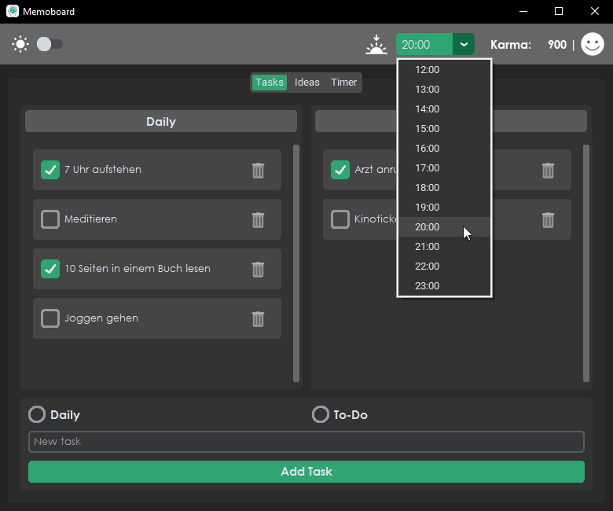
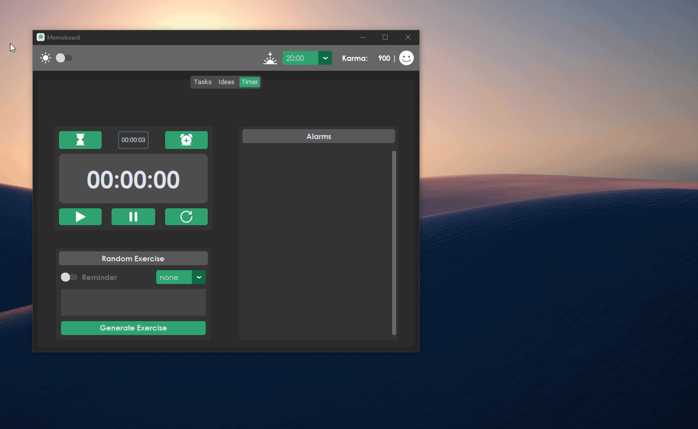

<h1 align="center">
   
  
   
   
</h1>

<h4 align="center">
    Ein minimalistisches Board um tägliche Aufgaben, Ideen und die Zeit im Auge zu behalten.
     
    Entwickelt für Windows unter Verwendung von <a href="https://customtkinter.tomschimansky.com/">CustomTkinter</a>.
</h4>

  <a href="#funktionen">Funktionen</a> •
  <a href="#tools-und-quellen">Tools und Quellen</a>

## Funktionen

Im Folgenden eine Übersicht über aller Funktionalitäten.

### Dark-Mode / Light-Mode
* Je nach persönlicher Präferenz steht die Wahl zwischen einem Dark-Mode und einem Light-Mode zur Verfügung

 

  
  

 

### Aufgaben und Karma-System
* Füge deine Gewohnheiten und neue To-Dos einer Liste hinzu.
* Tägliche Aufgaben (Gewohnheiten) und Aufgaben (To-Dos) sind wie folgt kategorisiert:
  - Erledigte Aufgaben: Diese werden mit Karma-Punkten belohnt
    - Gewohnheit (Daily) und To-Do: +300 Karma
  - Nicht erledigte Aufgaben: Diese führen zu einem Abzug von Karma-Punkten
    - Gewohnheit (Daily): -300 Karma
    - To-Do: -100 Karma

 

  

 

### Festlegen des Arbeitstages
* Du kannst selbst bestimmen, wann dein Arbeitstag endet. Die Karma-Punkte des Tages werden zu dieser Zeit berechnet, und es wird eine Rückmeldung darüber gegeben, wie erfolgreich dein Tag verlaufen ist.

 

  
    

 

### Sammeln von Ideen
* Du kannst Ideen, die dir tagsüber in den Sinn kommen, sammeln.

 

  

 

### Nutzen der Stoppuhr
* Die Stoppuhr kann genutzt werden, um die Dauer deiner Lern-, Arbeits- oder Trainingssession zu verfolgen.

 

  

 

### Einstellung eines Timers oder Weckers
* Du kannst Timer einstellen oder Wecker hinzufügen, um dich an bestimmte Aktivitäten oder Aufgaben zu erinnern.

 

  
   
   
  
  

 

### Erinnerung an Pausen
* Lass dich daran erinnern, Pausen einzulegen und kleine sportliche Übungen durchzuführen, um körperlich und geistig fit zu bleiben.

 

  

 

* Oder lass dir spontan eine Übung generieren.

 

  

 

## Tools und Quellen

* Python mit [CustomTkinter](https://customtkinter.tomschimansky.com/)
* Icons und Emojis von [Icons8](https://icons8.de/)

